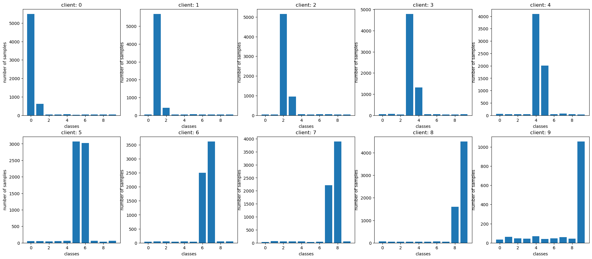
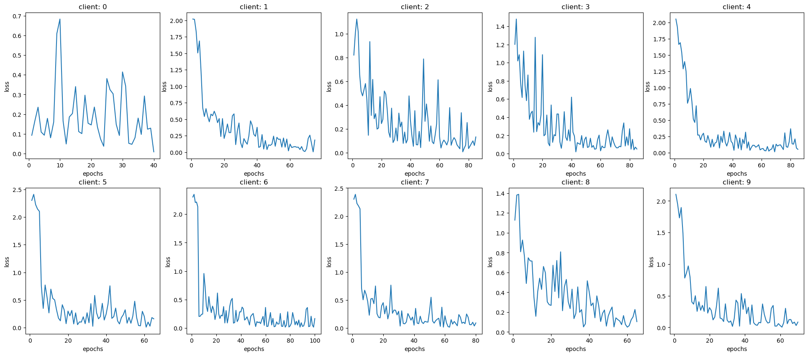

# Federated Learning

## Datasets

### MNIST


### CIFAR-10


## Data Distribution

### IID

- Data distributed in equal amounts and equal probabilities of labels

#### MNIST


#### CIFAR-10


### Unequal

- Data distributed in unequal amount but with equal probabilities of labels

#### MNIST


#### CIFAR-10


### Non-IID

- Data distributed in equal about but with unequal probabilities of labels

#### MNIST



#### CIFAR-10


### Unequal-Non-IID

- Data distributed in unequal amount and unequal probabilities of labels

#### MNIST


#### CIFAR-10


## Models

### Classical_CNN

- model for MNIST dataset

```
ClassicCNN(
  (net): Sequential(
    (0): Conv2d(1, 32, kernel_size=(5, 5), stride=(1, 1))
    (1): MaxPool2d(kernel_size=2, stride=2, padding=0, dilation=1, ceil_mode=False)
    (2): Conv2d(32, 64, kernel_size=(5, 5), stride=(1, 1))
    (3): MaxPool2d(kernel_size=2, stride=2, padding=0, dilation=1, ceil_mode=False)
    (4): Flatten(start_dim=1, end_dim=-1)
    (5): Linear(in_features=1024, out_features=512, bias=True)
    (6): ReLU(inplace=True)
    (7): Linear(in_features=512, out_features=10, bias=True)
  )
)
```

### CNN

- model for CIFAR-10 dataset

```
CNN(
  (net): Sequential(
    (0): Conv2d(3, 32, kernel_size=(3, 3), stride=(1, 1))
    (1): MaxPool2d(kernel_size=2, stride=2, padding=0, dilation=1, ceil_mode=False)
    (2): Conv2d(32, 64, kernel_size=(3, 3), stride=(1, 1))
    (3): MaxPool2d(kernel_size=2, stride=2, padding=0, dilation=1, ceil_mode=False)
    (4): Conv2d(64, 128, kernel_size=(3, 3), stride=(1, 1))
    (5): Flatten(start_dim=1, end_dim=-1)
    (6): Linear(in_features=2048, out_features=1024, bias=True)
    (7): ReLU(inplace=True)
    (8): Linear(in_features=1024, out_features=512, bias=True)
    (9): ReLU(inplace=True)
    (10): Linear(in_features=512, out_features=10, bias=True)
  )
)
```

## Results

### MNIST-IID

#### Learning Curve


#### Confusion matrix


#### Accuracy

```
Global Accuracy 0.9783041401273885 	Client avg Accuracy 0.978075396825397
Global Loss 0.6891199356291485 	Client avg Loss 0.6880262048145176

```

### MNIST-Unequal

#### Learning Curve



#### Confusion matrix


#### Accuracy

```
Global Accuracy 0.9702428343949044 	Client avg Accuracy 0.9717373007866529
Global Loss 0.7184312372940698 	Client avg Loss 0.710488627040429

```

### MNIST-Non-IID

#### Learning Curve


#### Confusion matrix


#### Accuracy

```
Global Accuracy 0.8728105095541401 	Client avg Accuracy 0.868819259751773
Global Loss 1.7569222869273917 	Client avg Loss 1.8059952318970889

```

### MNIST-Unequal-Non-IID

#### Learning Curve


#### Confusion matrix


#### Accuracy

```
Global Accuracy 0.7110867834394905 	Client avg Accuracy 0.7097222222222221
Global Loss 2.30258509299404 	Client avg Loss 2.3025850929940463

```

### CIFAR10-IID

#### Learning Curve


#### Confusion matrix


#### Accuracy

```
Global Accuracy 0.47611464968152867 	Client avg Accuracy 0.47688492063492066
Global Loss 5.717728091012483 	Client avg Loss 5.698858515033262

```

### CIFAR10-Unequal

#### Learning Curve


#### Confusion matrix


#### Accuracy

```
Global Accuracy 0.4589968152866242 	Client avg Accuracy 0.46009724458354145
Global Loss 6.368954534878408 	Client avg Loss 6.403438476325976

```

### CIFAR10-Non-IID

#### Learning Curve


#### Confusion matrix


#### Accuracy

```
Global Accuracy 0.19804936305732485 	Client avg Accuracy 0.19828789893617021
Global Loss 2.30258509299404 	Client avg Loss 2.3025850929940446

```

### CIFAR10-Unequal-Non-IID

#### Learning Curve


#### Confusion matrix


#### Accuracy

```
Global Accuracy 0.10121417197452229 	Client avg Accuracy 0.10178571428571428
Global Loss 2.30258509299404 	Client avg Loss 2.3025850929940463

```